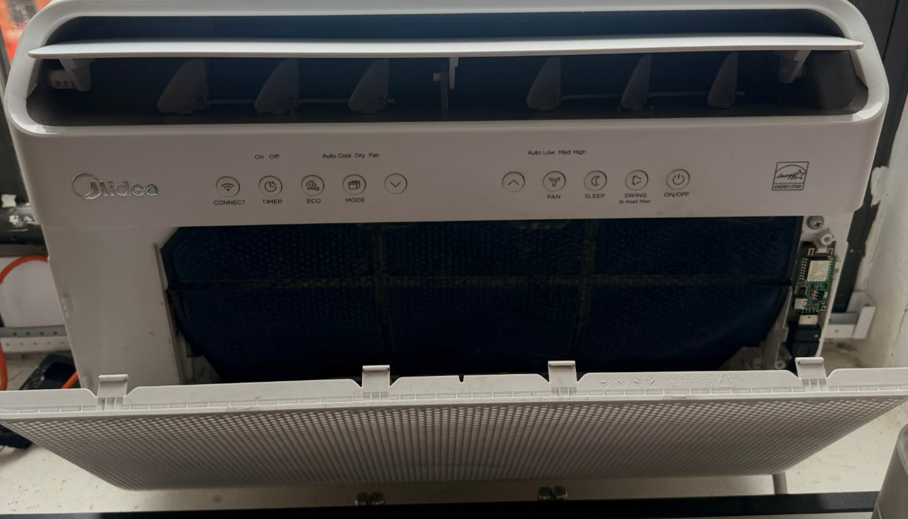
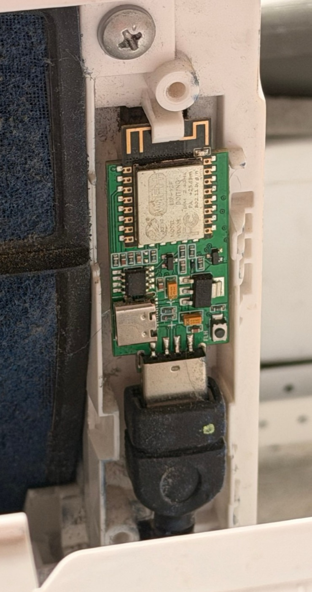
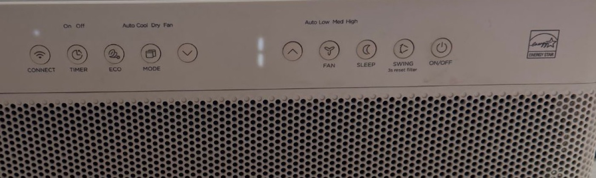

# Midea U-shaped window AC + Home Assistant (ESPHome)

Control a **Midea U-shaped window air conditioner** from **Home Assistant**,
locally over your own Wi-Fi — no Midea app, no cloud — **with working fan
speed control in cool mode**.

Out of the box, a pre-flashed ESPHome dongle can switch the AC on and off,
change the mode and the temperature. But in cool mode, **changing the fan speed
from Home Assistant silently does nothing**. This repo fixes that. The short
reason is the AC's energy-saving **ECO** mode; the whole story, in plain
language, is in **[ECO explained](docs/eco-explained.md)**.

## Does this apply to me?

Yes, if you have:

| | Tested with |
|---|---|
| Air conditioner | Midea U-shaped window AC — **MAW10V1QWT** (10,000 BTU) and **MAW08V1QWT** (8,000 BTU). Other U-shaped models probably behave the same, but haven't been tested. |
| Dongle | **SMLIGHT SLWF-01Pro**, pre-flashed with ESPHome, plugged into the AC |
| Home Assistant | Any recent version, with the **ESPHome** integration |
| ESPHome | **2026.9.0** (see [Compatibility](#compatibility)) |

> **Safety first:** Midea U-shaped ACs were part of a 2025 recall (mold). Check
> your unit with Midea before anything else.

## What changes

| In Home Assistant, you… | Stock dongle firmware | With this repo |
|---|---|---|
| Turn the AC on/off, pick cool / dry / fan only / auto | ✅ | ✅ |
| Change the temperature | ✅ | ✅ |
| Turn swing on/off | ✅ | ✅ — and it no longer resets your fan speed |
| Change fan speed in **fan only** | ✅ | ✅ |
| Change fan speed in **cool** | ❌ ignored | ✅ |
| See whether ECO is on, turn it on/off | ❌ invisible | ✅ ("Preset": `eco` / `none`) |
| Turn on **sleep** | ⚠️ only works if the fan is already on auto | ✅ from any fan speed |
| Sleep turned on from the AC's panel while ECO is on | shows as "eco" | shows as "sleep" |
| Press "high" on the AC's own panel | shows as "auto" | shows as "high" |

## How it fits together


The dongle is a tiny Wi-Fi computer (an ESP8266) that talks to the AC through
the USB port. **ESPHome** is the software running on it. This repo contains a
slightly modified version of ESPHome's Midea part; you install it by updating
the dongle's software once, over Wi-Fi.

## What you need

- The AC and the SLWF-01Pro dongle, plugged into the **USB port inside the AC,
  behind the filter door** (where Midea's own Wi-Fi stick would go). Turn the
  AC off before you open the filter door.

  
  

  *Filter door open: the dongle is in the slot on the right. Close-up: the
  SLWF-01Pro (v2.1, with its own USB-C port) plugged into the AC's USB port.*
- The dongle on your Wi-Fi and showing up in Home Assistant. A pre-flashed
  dongle that isn't on your Wi-Fi yet opens its own Wi-Fi network called
  **`AC-wifi-…`** (password **`slwf01pro`**). Join it with your phone, pick your
  home Wi-Fi on the page that opens, and Home Assistant will discover the
  dongle. (That's from SMLIGHT's
  [official firmware config](https://github.com/smlight-tech/slwf-01pro-esphome).)
  The dongle only supports **2.4 GHz** Wi-Fi.
- The **ESPHome Device Builder** add-on in Home Assistant
  (Settings → Add-ons → Add-on Store → *ESPHome Device Builder*). It lets you
  edit the dongle's configuration and update it over Wi-Fi.

## Setup, step by step

1. **Open ESPHome Device Builder** (in the Home Assistant sidebar). Your dongle
   should be listed; if it offers **Take control** / **Adopt**, do that. You
   now have a configuration file (YAML) for the dongle — click **Edit**.
2. **Keep what's already there** at the top — especially the `api:` and `ota:`
   sections. They contain the keys your dongle already uses; if you replace
   them, Home Assistant and ESPHome can lose the connection to it.

   > ⚠️ **Remove SMLIGHT's auto-update.** The pre-flashed firmware checks
   > SMLIGHT for updates and offers them in Home Assistant ("Firmware Update").
   > Installing one would **replace this repo's version with stock firmware**
   > and the fix would be gone. Delete these parts if your file has them:
   > the whole `update:` section, the whole `http_request:` section, and the
   > `- platform: http_request` line (plus its `id:` line) under `ota:`.
   > Keep `- platform: esphome` under `ota:`.
3. **Add this block** (anywhere at the top level, e.g. after `esp8266:`). It
   tells ESPHome to use the modified Midea part from this repo:

   ```yaml
   external_components:
     - source: github://kaaassspeeerrr/midea-u-shaped-esphome@v1.1.0
       components: [midea]
   ```

4. **Make sure the UART and climate parts look like this** (replace the
   existing `uart:` and `climate:` sections if they differ):

   ```yaml
   uart:
     tx_pin: 12
     rx_pin: 14
     baud_rate: 9600

   climate:
     - platform: midea
       name: "AC"
       autoconf: false
       visual:
         temperature_step: 1
       supported_modes:
         - HEAT_COOL   # the AC's AUTO mode (see "Auto mode" below)
         - COOL
         - DRY
         - FAN_ONLY
       supported_swing_modes:
         - VERTICAL
       supported_presets:
         - ECO
         - SLEEP
         - BOOST
   ```

   A complete example file is in [examples/midea-u-shaped.yaml](examples/midea-u-shaped.yaml).

5. **Save, then Install → Wirelessly.** ESPHome downloads this repo, builds
   the new software and sends it to the dongle (a few minutes the first time).
   The dongle restarts; the AC keeps running.
6. **Check it worked** (next section).

## Check that it worked

1. In Home Assistant, open the AC. Below the fan and swing settings there
   should now be a **Preset** setting (`none`, `eco`, `sleep`, `boost`), and the modes
   should include **Heat/Cool** (the AC's auto mode).
2. Set the AC to **cool**. After a moment the **ECO light on the AC turns on**
   by itself and the preset shows `eco`. That's normal (see
   [ECO explained](docs/eco-explained.md)).

   
3. Change the **fan speed** to low, then high. You should hear it change, and
   the ECO light stays on. With stock firmware, nothing would happen.

## Auto mode shows as "Heat/Cool"

These ACs have an **auto** mode (the AC picks the fan speed itself). In the
config it's listed as `HEAT_COOL`, so in Home Assistant it's called
**Heat/Cool** — even though the AC only cools.

Why not call it "Auto"? Home Assistant's ESPHome integration **hides the
temperature setting whenever a device is in "Auto"**, but these ACs do use the
temperature in auto mode. As "Heat/Cool" you keep the temperature control.
We've asked Home Assistant to change this:
[feature request #4997](https://github.com/orgs/home-assistant/discussions/4997).

Tip: on a dashboard you can still label it "Auto" — e.g. a button card named
"Auto" whose tap action is `climate.set_hvac_mode` with `hvac_mode: heat_cool`.

In auto mode the fan is always on auto (the AC decides), and ECO switches on
by itself, like in cool.

## Troubleshooting

| Problem | What to check |
|---|---|
| Fan speed still doesn't change in cool | Is there a **Preset** setting on the AC in Home Assistant? If not, the update didn't install — check the install log in ESPHome Device Builder. |
| Fan speed in **dry** or **auto** is always auto | Normal — the AC decides the fan speed in those modes. |
| ECO keeps turning itself back on | Normal — the AC switches ECO on every time it enters cool. Turn it off with Preset → `none`. |
| Build fails after an ESPHome update | See [Compatibility](#compatibility). |
| Dongle shows "unavailable" | Check it's still in the USB port and on Wi-Fi. Giving it a fixed IP address in your router helps. |
| Fan is stuck on auto in **sleep** | Normal — the AC only runs sleep with the fan on auto. Pick another preset (or `none`) to change the fan again. |
| Sleep turned off when I changed mode | Normal — changing mode ends sleep (the AC then picks its default, usually ECO on). |
| Can't turn ECO **on** from Home Assistant in auto or dry | Known limitation: ESPHome only allows choosing ECO in cool. The AC still switches ECO on by itself in auto and dry. |
| "Firmware Update" from SMLIGHT shows up in Home Assistant | Don't install it — it replaces this repo's version. Remove the `update:` part from the config (Setup, step 2). |
| Cooling is weak or the unit is loud | Clean the air filter (behind the filter door). The **Check Filter** light comes on after 250 hours; hold **SWING** for 3 s to reset it. |

## Going back to stock

Remove the `external_components:` block, keep the rest, and **Install**
again. Everything works as before, including the fan-speed limitation.

## Compatibility

The modified part is a copy of ESPHome **2026.9.0**'s Midea component. Newer
ESPHome versions will usually still build it, but if a future ESPHome changes
its internals the build can fail. If that happens, open an issue here.

## Presets

| Preset | What it does (Midea's manual) | With this repo |
|---|---|---|
| `eco` | **Energy Saver**: when the room reaches your temperature the compressor stops, the fan runs 3 more minutes, then only 2 minutes every 10 minutes. Cool, dry and auto only. | ✅ on/off; fan speed works with it on |
| `sleep` | Raises the set temperature by 2 °F after 30 minutes and another 2 °F after an hour, holds it for 7 hours, then returns. Cooling only. | ✅ from any fan speed. The fan is kept on auto while sleep is on (the AC requires it). Not available in dry or fan only. |
| `boost` | **Not in Midea's manual**, and there's no button for it. | ⚠️ The AC accepts and reports it, turns ECO off, shows no icon; sounded slightly louder than high (not measured). Use at your own discretion. |

## Official documentation

- Midea owner's manual for MAW08V1QWT / MAW10V1QWT (EN/FR):
  [midea.com PDF](https://www.midea.com/content/dam/midea-aem/ca/1200-x-1200-resized/u-shaped-ac/User-Manual-MAW10V1QWT.pdf)
- Midea U installation guide:
  [midea.com PDF](https://www.midea.com/content/dam/midea-aem/us/air-conditioners/window-air-conditioners/u-shape-all-models/Midea%20U%20AC%20Installation%20Guide.pdf)
- SMLIGHT SLWF-01Pro official ESPHome configs:
  [smlight-tech/slwf-01pro-esphome](https://github.com/smlight-tech/slwf-01pro-esphome)

## More detail

- [ECO explained](docs/eco-explained.md): what ECO does, what went wrong, what we changed and what we deliberately didn't
- [Test results](docs/test-results.md): every control, tested on both models
- [Advanced: reading the dongle's messages](docs/protocol.md), for developers
- [What was changed in the code](lib/MideaUART/PATCHES.md) · [Changelog](CHANGELOG.md)

## Licence

GPLv3 (see [LICENSE](LICENSE)). Contains:

- `components/midea/`: from ESPHome 2026.9.0 (C++ GPLv3, Python MIT;
  © ESPHome). See [NOTICE](components/midea/NOTICE.md).
- `lib/MideaUART/`: from [dudanov/MideaUART](https://github.com/dudanov/MideaUART)
  (MIT, © Sergey Dudanov), with the patches listed in its PATCHES.md.

Not affiliated with Midea, SMLIGHT or ESPHome.
