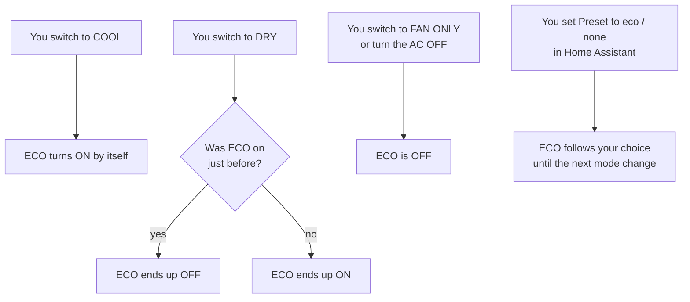
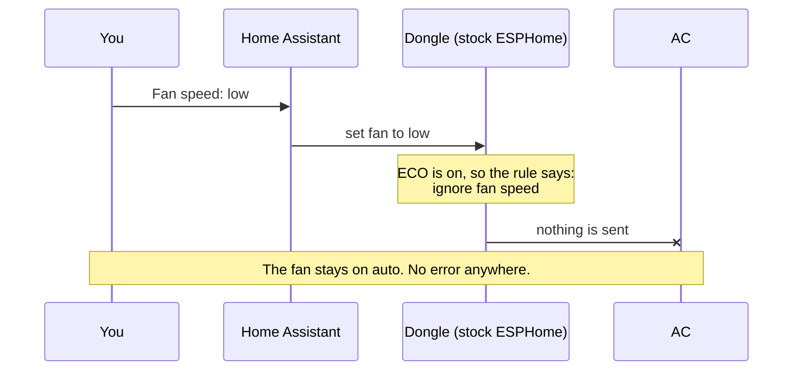
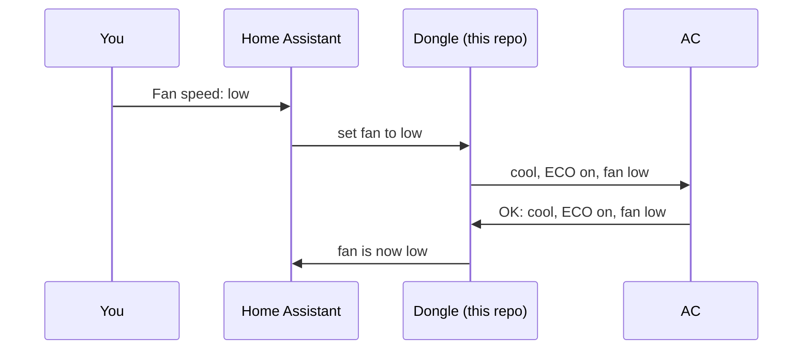
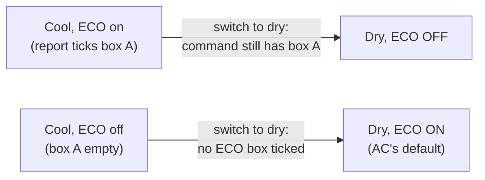

# ECO explained

This page explains, without jargon, what ECO is on these air conditioners, why
it broke fan-speed control, what this repo changes — and what it deliberately
leaves alone.

## What ECO is

ECO is the AC's **energy-saving mode**. When it's on, the **ECO light** on the
AC's panel is lit. Midea doesn't document exactly what ECO changes on these
units; you can turn it on and off with the ECO button on the AC, or (with this
repo) from Home Assistant.

## The AC turns ECO on by itself

The most important thing to know: **every time the AC switches into cool, it
turns ECO on by itself**, even if you had turned it off before. What happens in
the other modes:

Both tested models (8,000 and 10,000 BTU) behave exactly like this. Dry mode's
"it depends" is explained [further down](#why-dry-mode-depends-on-what-came-before).

## The problem: fan speed was ignored

ESPHome — the software on the dongle — has a built-in rule: **while ECO (or any
other preset) is on, ignore fan-speed changes and keep the fan on auto.** The
rule comes from the general Midea library ESPHome uses, which covers many
Midea models. Combine it with "the AC turns ECO on
by itself in cool", and you get this:

Two more things made it confusing:

- Stock ESPHome **didn't show ECO in Home Assistant at all**, so there was no
  way to see why fan speed was ignored, or to turn ECO off.
- Changing **swing** while ECO was on also reset the fan to auto (same rule).

But the rule isn't needed on these units: pressing the **fan button on the
AC's own panel** with ECO on changes the speed just fine, and ECO stays on.

## What this repo changes

1. **Fan speed works while ECO is on.** The "ignore fan speed" rule now only
   applies to Midea's *auto* mode, which these cooling-only units don't have.
2. **ECO shows up in Home Assistant** as a *Preset* setting: `eco` = ECO on,
   `none` = ECO off. (This part only needs `supported_presets: [ECO]` in the
   config; it works with stock ESPHome too.)
3. **"High" from the AC's panel shows as high.** The panel reports its high
   speed with a different number than ESPHome expected, so it used to show up
   as "auto".

## What this repo deliberately does *not* change

**ECO still turns itself on in cool.** We could have made the dongle switch
ECO off automatically, but that would fight the AC and throw away its
energy saving. Since fan speed now works either way, there's no need: if you
don't want ECO, set Preset to `none` after switching to cool (or write an
automation that does).

**Dry mode's ECO behaviour is left as the AC does it** (the "it depends" in the
diagram). It's consistent — both models do the same — and fan speed in dry is
always auto anyway, so ECO makes no practical difference there.

## Decisions log

| # | Decision | Why | Alternatives considered |
|---|---|---|---|
| 1 | Show ECO in Home Assistant (Preset) | Without it you can't see or change ECO | — |
| 2 | Let fan speed work while ECO is on (code change) | That's what the AC's own panel allows | Automatically turn ECO off whenever you pick a fan speed — rejected: it throws away the energy saving and fights the AC |
| 3 | Keep ECO turning itself on in cool | It's the AC's own behaviour and harmless now | Force ECO off in cool |
| 4 | Read panel "high" as high | It showed as "auto", which was simply wrong | — |
| 5 | Leave dry-mode ECO as the AC does it | Consistent on both models; no effect on fan speed | Force ECO always off in dry, or always on |
| 6 | Don't offer Sleep | These units have no sleep mode; the AC ignores it | — |
| 7 | Offer Boost | The AC accepts it and reports it back | — |

## Why dry mode depends on what came before

This one is a quirk of how the dongle talks to the AC. Each time the dongle
sends a command, it starts from a **copy of the AC's last status report** and
changes what needs changing. Status reports and commands use **different
"checkboxes" for ECO**:

- In a status report, the AC ticks box **A** when ECO is on.
- In a command, the dongle ticks box **B** to ask for ECO on.

Because commands start as a copy of the last report, box A is still ticked
when ECO *was* on. These ACs read a leftover box A as **"ECO off, please"**.
And if neither box is ticked, the AC picks its own default for the new mode:
**ECO on**.

In cool you don't notice this, because the AC's default for cool is ECO on
anyway — and when ECO was on in dry, ESPHome re-sends it after switching to
cool. For the byte-level details, see [protocol.md](protocol.md).
