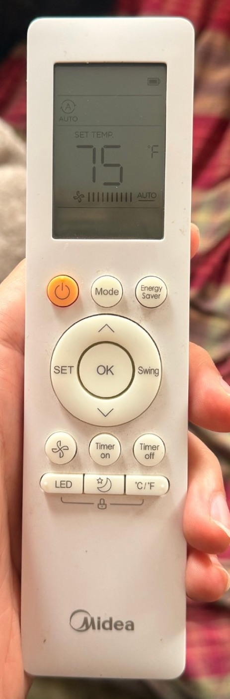
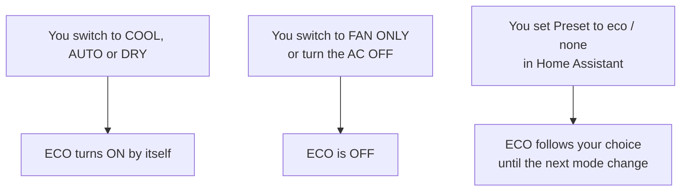
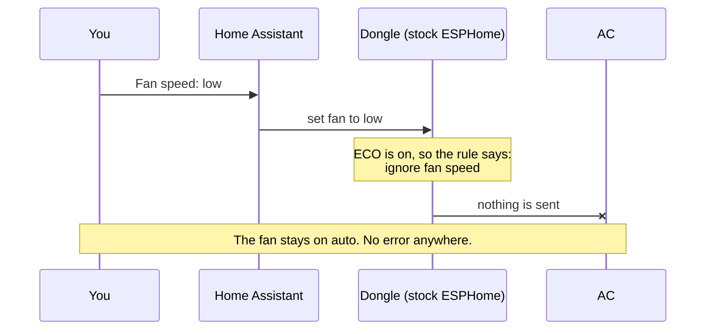
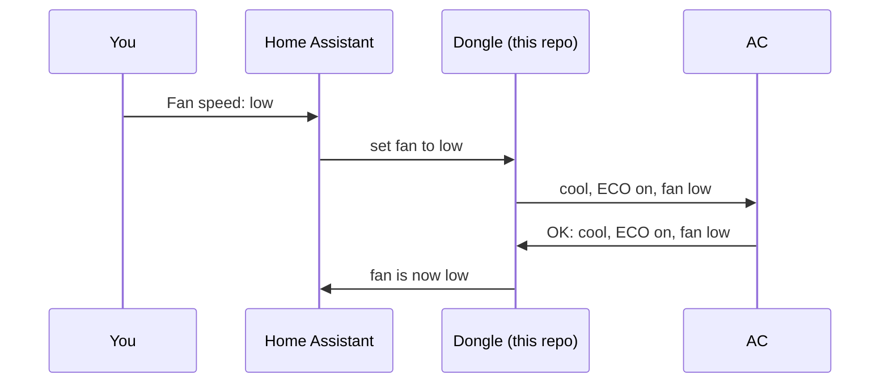
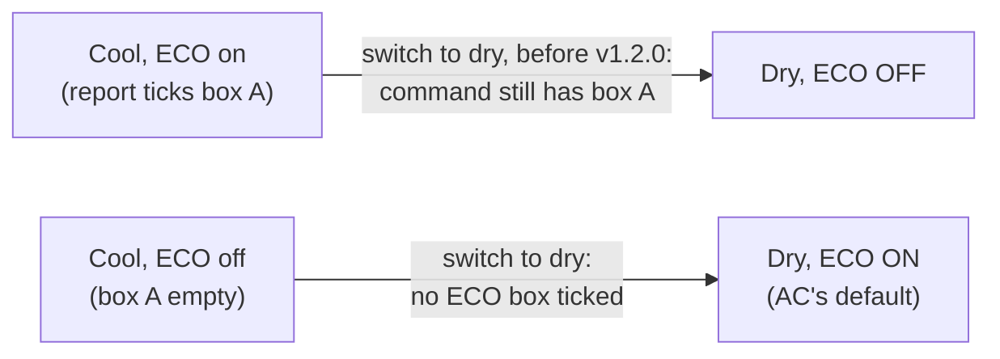

# ECO explained

This page explains, without jargon, what ECO is on these air conditioners, why
it broke fan-speed control, what this repo changes — and what it deliberately
leaves alone.

## What ECO is

ECO is the AC's **energy-saving mode** ("Energy Saver" in Midea's
[owner's manual](https://www.midea.com/content/dam/midea-aem/ca/1200-x-1200-resized/u-shaped-ac/User-Manual-MAW10V1QWT.pdf)).
When it's on, the **ECO light** on the AC's panel is lit. On the remote the
same button is called **Energy Saver**.

What it does, according to the manual: when the room reaches your set
temperature the **compressor stops**, the fan keeps running for 3 minutes, and
after that the fan only runs **2 minutes out of every 10** until cooling is
needed again. Without ECO the fan runs all the time. ECO only exists in cool,
dry and auto.

So with ECO on, the fan speed you choose applies while the AC is cooling; in
between cooling cycles the fan pauses.

You can turn ECO on and off with the ECO button on the AC, the remote, or
(with this repo) from Home Assistant — in cool, dry and auto.

## The AC turns ECO on by itself

The most important thing to know: **every time the AC switches into cool, it
turns ECO on by itself**, even if you had turned it off before. The manual
says the same about switching the AC on: it "will automatically switch on the
Energy Saver Function" for cool, dry and auto. What happens in
the other modes:

Both tested models (8,000 and 10,000 BTU) behave exactly like this. (Before
v1.2.0, dry was an exception — see [the end of this page](#before-v120-why-dry-mode-depended-on-what-came-before).)

## The problem: fan speed was ignored

ESPHome — the software on the dongle — has a built-in rule: **while ECO (or any
other preset) is on, ignore fan-speed changes and keep the fan on auto.** The
rule comes from the general Midea library ESPHome uses, which covers many
Midea models. Combine it with "the AC turns ECO on
by itself in cool", and you get this:

Two more things made it confusing:

- Stock ESPHome **didn't show ECO in Home Assistant at all**, so there was no
  way to see why fan speed was ignored, or to turn ECO off.
- Changing **swing** while ECO was on also reset the fan to auto (same rule).

But the rule isn't needed on these units: pressing the **fan button on the
AC's own panel** with ECO on changes the speed just fine, and ECO stays on.

## What this repo changes

1. **Fan speed works while ECO is on.** The "ignore fan speed" rule now only
   applies to the AC's *auto* mode, where the AC chooses the fan speed itself
   anyway.
2. **ECO shows up in Home Assistant** as a *Preset* setting: `eco` = ECO on,
   `none` = ECO off. (This part only needs `supported_presets: [ECO]` in the
   config; it works with stock ESPHome too.)
3. **"High" from the AC's panel shows as high.** The panel reports its high
   speed with a different number than ESPHome expected, so it used to show up
   as "auto".

## What this repo deliberately does *not* change

**ECO still turns itself on in cool.** We could have made the dongle switch
ECO off automatically, but that would fight the AC and throw away its
energy saving. Since fan speed now works either way, there's no need: if you
don't want ECO, set Preset to `none` after switching to cool (or write an
automation that does).

**ECO also turns itself on in dry and auto** — the AC's own default. You can
switch it off (or back on) there from Home Assistant since v1.2.0.

## Decisions log

| # | Decision | Why | Alternatives considered |
|---|---|---|---|
| 1 | Show ECO in Home Assistant (Preset) | Without it you can't see or change ECO | — |
| 2 | Let fan speed work while ECO is on (code change) | That's what the AC's own panel allows | Automatically turn ECO off whenever you pick a fan speed — rejected: it throws away the energy saving and fights the AC |
| 3 | Keep ECO turning itself on in cool | It's the AC's own behaviour and harmless now | Force ECO off in cool |
| 4 | Read panel "high" as high | It showed as "auto", which was simply wrong | — |
| 5 | Leave dry-mode ECO as the AC does it (v1.0.0–v1.1.0) | Consistent on both models; no effect on fan speed | Force ECO always off in dry, or always on |
| 6 | Offer Sleep, keep the fan on auto while it's on | The AC only accepts sleep with the fan already on auto; the dongle switches the fan to auto first, then sends sleep (v1.1.0). An early test wrongly concluded there was no sleep mode | — |
| 7 | Offer Boost, marked undocumented | The AC accepts and reports it, but it isn't in Midea's manual and there's no button for it | Remove it |
| 8 | Offer the AC's auto mode as `HEAT_COOL` ("Heat/Cool") | Home Assistant hides the temperature in "Auto"; these ACs use it | Show it as "Auto" and lose the temperature control — rejected; [asked HA to fix it](https://github.com/orgs/home-assistant/discussions/4997) |
| 9 | Show "sleep" when sleep and ECO are both on | Both can be on at once (e.g. SLEEP pressed on the panel); ECO turns on by itself, sleep only on purpose | Show "eco" (upstream) |
| 10 | Let Home Assistant choose ECO in dry and auto too (v1.2.0) | Midea's manual lists Energy Saver for cool, dry and auto; the library only allowed cool. Side effect: ECO carries over from cool into dry, so dry always ends up with ECO on | Keep ECO choosable in cool only |

## Before v1.2.0: why dry mode depended on what came before

Up to v1.1.0, switching into dry left ECO **off** if ECO had been on in cool,
and **on** if it had been off. The reason is a quirk of how the dongle talks to
the AC. Each command starts from a **copy of the AC's last status report**, and
reports and commands use **different "checkboxes" for ECO**:

- In a status report, the AC ticks box **A** when ECO is on.
- In a command, the dongle ticks box **B** to ask for ECO on.

A leftover box A in a command means **"ECO off, please"** to these ACs; with
neither box ticked, the AC uses its default for the new mode, **ECO on**. The
library treated ECO as cool-only, so from cool+ECO it switched to dry with the
leftover box A — ECO off.

Since v1.2.0 ECO is allowed in dry, so the dongle carries it over (ticks box B)
and dry always ends up with ECO on. For the byte-level details, see
[protocol.md](protocol.md).
